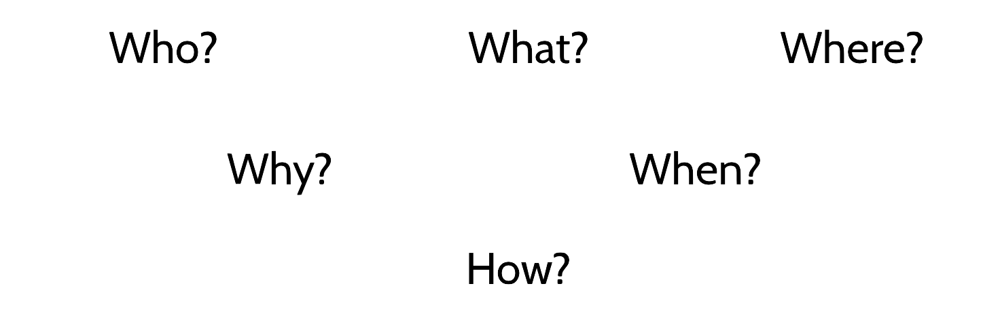
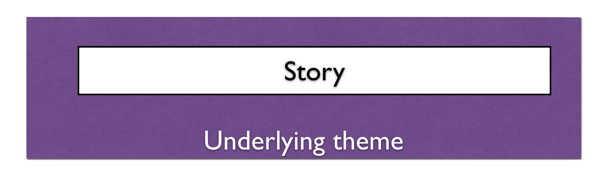

# Terminology

## Exposition

> Exposition is the information that grounds you in a story: who, what, where, when, and why" is about "**giving away what the audience needs, when the audience needs it**.

We'll [discuss this in more detail in the exposition section](exposition.md).

## Train / Narrative Spine

> “No film set on a train ever failed”

The quote is an inside joke on the double meaning of the word **train**. That in story terminology stands as synonym for narrative spine, and how earlier films have often involved trains in some capacity. From top left: [Lumiere brothers "Train at La Ciotat"](https://youtu.be/1dgLEDdFddk), ["Night Mail Train"](https://youtu.be/-WO7JxYlhOM) produced by the GPO Film Unit,[ Dziga vertov "Man with the Movie Camera"](https://youtu.be/cGYZ5847FiI), "[Chronicle of a summer" Edgar Morin and Jean Rouch](https://en.wikipedia.org/wiki/Chronique_d'un_été).

> storytelling to **move forward** you want the audience to be curious about the information you’re giving them.
>
> your goal is to create a film that’s driven by a story, one that will motivate even general viewers to want to know more of those details that thrill you.

## Theme

> the general **underlying subject** of a specific story, a recurring idea that often illuminates an aspect of the human condition.

## Arc

> The arc refers to the way or ways in which the events of the story **transform your characters**

In an over simplification we could say that if a Character goes from `A` to `B`. That's some kind of a journey.

But if they Go from `A` to `C` going through `B`. Where in `B` they have some kind of transformation so that our character at `A` and our character at `C` are different, then you got a story ARC. The difference could as small as change of mind of some view of the world and as big as a character transformation where they could almost be distinct as two different people.

## Plot and Character

> A **character-driven** film is one in which the action of the film emerges from the wants and needs of the characters.
>
> In a  **plot-driven film**, the characters are secondary to the events that make up the plot.

