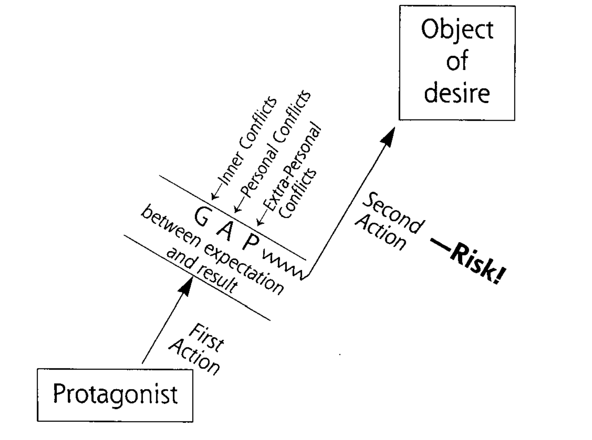

# The Gap

## One Gap

> “STORY is born in that place where the subjective and objective realms touch.” - Mckee p147

## Subsequent Gaps

> “The protagonist's first action has aroused forces of antagonism that block his desire and spring open a gap between anticipation and result, disconfirming his notions of reality, putting him in greater conflict with his world, at even greater risk. But the resilient human mind quickly remakes reality into a larger pattern that incorporates this disconfirmation, this unexpected reaction. Now he takes a second, more difficult and risk-taking action, an action consistent with his revised vision of reality, an action based on his new expectations of the world.\[..\]” - Mckee p151

